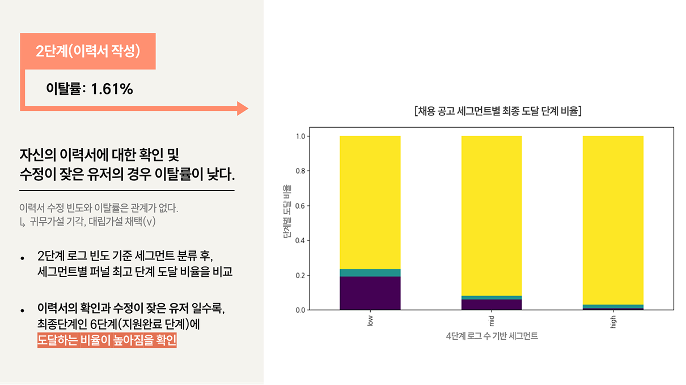
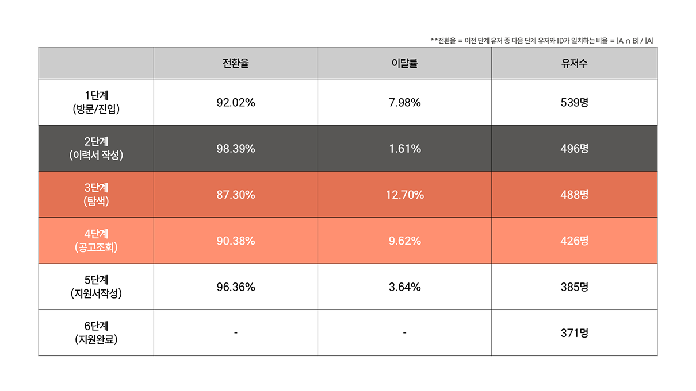
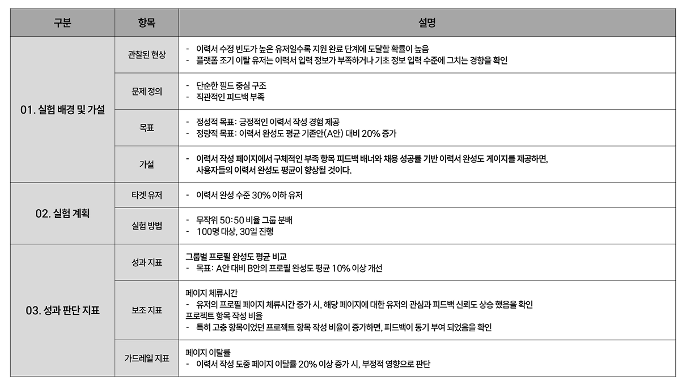

# 🧑‍💼 채용 플랫폼 '지원 비완료 탐색 유저' 이탈 개선 프로젝트

> **분석 기간** &nbsp;|&nbsp;  2025.04.04 - 2025.04.28 <br/>
> **분석 주체** &nbsp;|&nbsp;  팀 프로젝트 (팀원: 양태호, 최명빈, 유정원, 위이태인) <br/>
> **분석 기법** &nbsp;|&nbsp; 퍼널 분석, 페르소나 기법, A/B Test 설계 <br/>
> **분석 기술** &nbsp;|&nbsp;       <br/> 

---

## 0. 들어가기 전에

### 📂 디렉토리 구조

```plaintext
📁 job_funnel_analysis_project/
 ┣ 📁 notebooks/         분석 코드 (Colab)
 ┣ 📁 images/            시각화 결과 (유저 여정, 체류시간 등)
 ┣ 📁 reports/           분석 보고서 및 발표자료 (PDF)
 ┣ 📄 README.md          프로젝트 설명 문서
```

---

## 1. 프로젝트 개요

### 📌 세 줄 요약
- 채용 플랫폼에서 유저 539명의 전환 흐름을 분석해 이탈 원인을 파악했습니다.  
- 로그 데이터를 기반으로 탐색 > 클릭 > 지원 흐름의 병목 구간을 진단했습니다.  
- 전환율 개선을 위한 UX 제안과 A/B 테스트 설계를 통해 실행 가능성까지 검토했습니다.  

---

## 2. 문제 정의 및 접근 방식

### 🔍 Situation
- 구직 서비스에서 공고 조회 수는 많지만 클릭률이 낮고, 지원까지의 전환율도 저조한 문제가 발생  

### 💡 Task  
- 탐색 → 공고 클릭 → 지원으로 이어지는 유저 전환 퍼널을 정의하고, 이탈이 심한 구간의 원인을 분석  

### 🏃 Action
- 로그 기반 유저 행동 흐름 분석, 클릭률 저하 요인별 가설 수립 및 통계적 검정, 개선 제안 및 A/B 테스트 설계  

### 🚀 Result
- 공고 매체 및 구성요소, 체류시간 기반의 정량적 이탈 원인 도출 및 UX 기반 개선 전략 도출  

---

## 3. 프로젝트 진행

### 3-1) 📊 EDA 요약: 통계 요약

- 기초 통계 시각화 요약 삽입

---

### 3-2) 🧪 가설 검정: 클릭률 저하 원인 분석

- **H1. 체류 시간이 짧은 유저일수록 클릭률이 낮다**  
  ↳ 평균 체류 시간이 클릭 유저 대비 비클릭 유저에서 유의하게 낮음 (p-value < 0.001)  
  ↳ 추천 기반 방문자일수록 체류 시간이 짧고, 이탈률이 높음  

- **H2. 공고 수가 많을수록 오히려 클릭률이 떨어진다 (정보 과부하)**  
  ↳ 탐색 페이지당 공고 수와 클릭률 간 음의 상관관계 존재  
  ↳ 페이지당 12개 초과 시 클릭률이 급격히 하락  

- **H3. 공고 제목/회사 정보의 정보량이 낮을수록 클릭률이 낮다**  
  ↳ 공고 상세정보 노출 유무에 따라 클릭률 유의미한 차이 발생 (카이제곱 검정 결과 p < 0.01)



---

### 3-3) 🎞️ 분석 프레임워크 

#### 페르소나 기법
- 내용/이미지

#### 퍼널 분석 기법
- 유저 로그 데이터를 바탕으로 5단계 퍼널 정의  
  (홈 진입 → 탐색 → 공고 클릭 → 이력서 작성 → 최종 지원)

- 각 단계별 전환율 분석 결과, **3단계 (탐색 → 공고 클릭)** 구간에서 이탈률이 가장 높음  
- URL, 시간, 공고 수 등의 특성을 기반으로 탐색 행동을 세분화  



#### A/B 테스트 설계



- 각 전략(A안/B안)에 대한 실험 설계표, KPI 정의, 가설 세트 명시

---

## 4. 프로젝트 회고
### ✏️ Learned Lessons
- 유저 퍼널 분석은 단순한 페이지뷰가 아닌 **행동 흐름과 의도**에 기반해야 함을 깨달음  
- 체류 시간과 클릭률 간의 관계에서 **UX 피드백과 데이터 지표 해석이 함께 필요**함을 실감  
- 데이터를 기반으로 **A/B 테스트 안까지 연결된 인사이트 도출**을 연습해본 의미 있는 경험이었음  
